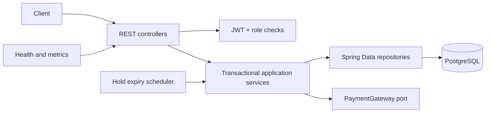
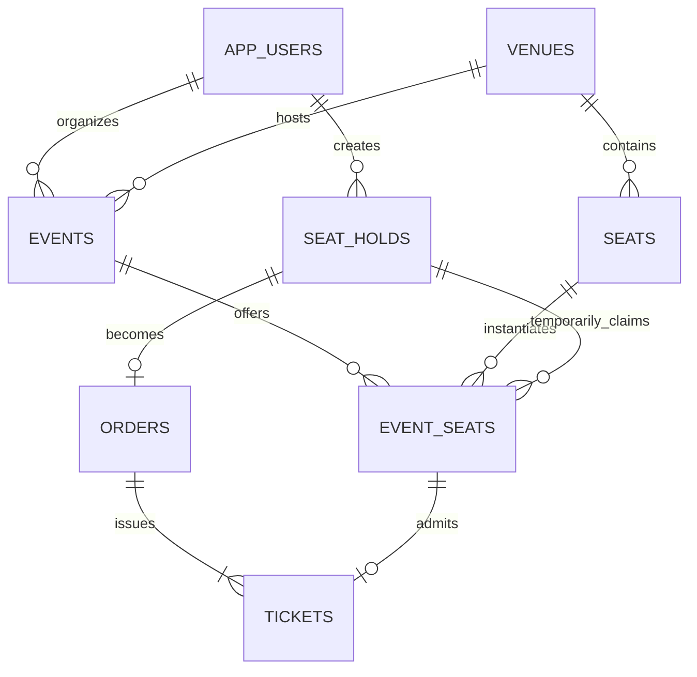

# TicketForge

[](https://github.com/ryanjoemcmanus/ticketforge/actions/workflows/ci.yml)
[](https://openjdk.org/projects/jdk/21/)
[](https://spring.io/projects/spring-boot)
[](LICENSE)

TicketForge is a production-style event ticketing reference implementation built with Java and Spring Boot. It demonstrates layered backend architecture, relational modeling, authentication, concurrency control, transactions, idempotency, testing, and operability.

It includes a responsive customer/organizer web experience at `/`, while preserving the REST API as the architectural center. The default configuration is intended for local development and does not process real payments.

The hardest guarantee is simple to state:

> Two customers can race for the same event seat, but only one active hold can win and a sold seat can never be sold again.

## Highlights

- Java 21 and Spring Boot 4 modular monolith
- PostgreSQL as the source of truth, with Flyway-owned schema changes
- REST resources for auth, venues, physical seats, events, event inventory, holds, orders, and tickets
- BCrypt password hashing and stateless HMAC-signed JWT access tokens
- Email verification, rotating/revocable refresh tokens, password reset, five-attempt lockout, and admin organizer approval
- `CUSTOMER`, `ORGANIZER`, and `ADMIN` authorization boundaries
- Ten-minute seat holds with explicit lifecycle and scheduled expiry
- PostgreSQL pessimistic row locks, deterministic lock order, optimistic versions, unique constraints, and transactional checkout
- Idempotent checkout using a customer-scoped `Idempotency-Key`
- Policy-based cancellation/refunds with ticket cancellation, inventory release, and immutable audit events
- Event categories, text/category search, draft-only editing and section pricing, cancellation guards, and organizer sales analytics
- Token-only mock payment adapter; card details never enter this service
- Opt-in Stripe test-mode PaymentIntent/refund adapter that rejects live API keys
- After-commit verification, password-reset, order, and refund notifications through logging or SMTP adapters
- Idempotent demo-data profile with three roles, 30-seat inventory, and three upcoming events
- Responsive customer discovery/seat/checkout flow and organizer analytics dashboard
- RFC 9457-style `ProblemDetail` error responses and Bean Validation
- OpenAPI/Swagger UI, Actuator health/metrics, request correlation IDs, and structured console logs
- JUnit, Mockito/AssertJ, and a real PostgreSQL concurrency test with Testcontainers
- Multi-stage local workflow with Maven Wrapper, Docker, Compose, and GitHub Actions

The complete V1 assessment and migration rationale is in [docs/V1_ANALYSIS.md](docs/V1_ANALYSIS.md).

## Architecture



Packages are organized by business capability (`auth`, `catalog`, `reservation`, `order`, `user`) with `config` and `common` as narrow supporting modules. Controllers own HTTP contracts, services own use-case transactions, entities own small state transitions, and repositories own persistence queries. This stays understandable as one deployable unit while maintaining seams that could later become services if scale justified it.

## Inventory and concurrency model

Physical seats belong to a venue. An `EventSeat` is the sellable, priced copy of a physical seat for one event.

```text
AVAILABLE --place hold--> HELD --checkout--> SOLD
    ^                       |
    |---- cancel/expire ----|
```

Creating a hold runs in one database transaction:

1. Deduplicate and sort requested event-seat UUIDs.
2. Select those rows with `PESSIMISTIC_WRITE` (`SELECT ... FOR UPDATE` semantics).
3. Reclaim any stale holds observed while holding the lock.
4. Validate that every row exists, belongs to one published future event, and is available.
5. Persist the hold and transition all inventory rows to `HELD` with one expiry instant.
6. Commit atomically.

Sorting IDs ensures competing multi-seat requests acquire locks in the same order, reducing deadlock risk. The unique `(event_id, seat_id)` constraint prevents duplicate inventory. A `SOLD` transition clears hold metadata but retains the event-seat record, and `tickets.event_seat_id` is unique. The scheduled cleanup is useful for prompt availability; correctness does not depend on scheduler timing because a reservation attempt reclaims an expired hold while it owns the row lock.

Checkout locks the hold, verifies ownership and expiry, locks its inventory, charges through the payment port, writes one order, marks inventory sold, transitions the hold, and issues tickets in one transaction. A retry with the same customer and idempotency key returns the original order. Different keys cannot check out the same hold because the hold is locked and `orders.hold_id` is unique.

## Data model



Money uses `NUMERIC(12,2)`/`BigDecimal`; timestamps use UTC `TIMESTAMPTZ`/`Instant`; identifiers are UUIDs.

## Run locally

Requirements: Docker Desktop (or Docker Engine with Compose). Java is only required when running outside containers.

```bash
./mvnw clean package
docker compose up --build
```

Then open:

- Web application: `http://localhost:8080/`
- Swagger UI: `http://localhost:8080/swagger-ui.html`
- OpenAPI JSON: `http://localhost:8080/v3/api-docs`
- Health: `http://localhost:8080/actuator/health`

Environment variables:

| Variable | Default | Purpose |
|---|---|---|
| `DB_URL` | `jdbc:postgresql://localhost:5432/ticketforge` | JDBC connection URL |
| `DB_USERNAME` | `ticketforge` | Database user |
| `DB_PASSWORD` | `ticketforge` | Database password |
| `JWT_SECRET` | unsafe development value | HMAC key; replace in every real environment |
| `PORT` | `8080` | HTTP port |
| `EXPOSE_DEVELOPMENT_TOKENS` | `false` | Return verification/reset tokens in API responses for local demos only |
| `DEMO_DATA` | `false` | Seed local demo users, venue, seats, and future events |
| `DEMO_PASSWORD` | `DemoPass123!` | Local seeded-account password; demo mode only |
| `PAYMENT_PROVIDER` | `mock` | `mock` or `stripe`; Stripe adapter accepts test keys only |
| `STRIPE_SECRET_KEY` | empty | Stripe `sk_test_...` key when test-mode payments are enabled |
| `NOTIFICATION_PROVIDER` | `log` | `log` or `smtp` delivery |
| `APP_URL` | `http://localhost:8080` | Base URL used in verification/reset links |
| `BOOTSTRAP_ADMIN_EMAIL` | empty | Create the first administrator on an empty installation |
| `BOOTSTRAP_ADMIN_PASSWORD` | empty | First-admin password; configure together with the email (12+ characters) |

Do not use the checked-in development credentials or JWT key in production. Inject secrets from a secret manager and terminate TLS at the ingress/load balancer.

## API walkthrough

1. Register with `POST /api/v1/auth/register`, then verify using `POST /api/v1/auth/verify-email`. Compose enables development token delivery; production must connect an email adapter.
2. On a fresh installation, set the two `BOOTSTRAP_ADMIN_*` variables once. The verified admin can approve organizer accounts with `POST /api/v1/auth/organizers/{id}/approve`; customers require no approval.
3. Sign in to receive a short-lived access token and a rotating 30-day refresh token, then create a venue with `POST /api/v1/venues`.
4. Add physical seats in a batch with `POST /api/v1/venues/{venueId}/seats`.
5. Create an event with `POST /api/v1/events`; all current venue seats become priced event inventory.
6. Publish with `POST /api/v1/events/{eventId}/publish`.
7. Register a customer and browse `GET /api/v1/events/{eventId}` to obtain event-seat IDs.
8. Hold up to eight event seats with `POST /api/v1/holds`.
9. Checkout with `POST /api/v1/orders`, header `Idempotency-Key: <stable-client-key>`, body `{ "holdId": "...", "paymentToken": "tok_visa" }`.
10. Retry the exact checkout safely: the original order and tickets are returned.

Use `tok_decline` to exercise the payment-declined path. The mock gateway intentionally accepts only opaque strings beginning with `tok_`; this demonstrates the boundary without pretending to implement PCI-compliant payments.

## Endpoint summary

| Method | Path | Access |
|---|---|---|
| `POST` | `/api/v1/auth/register` | Public; customer/organizer only |
| `POST` | `/api/v1/auth/login` | Public |
| `POST` | `/api/v1/auth/verify-email`, `/refresh`, `/logout` | Public token operations |
| `POST` | `/api/v1/auth/password-reset/request`, `/confirm` | Public recovery flow |
| `POST` | `/api/v1/auth/organizers/{id}/approve` | Admin |
| `POST` | `/api/v1/venues` | Organizer/admin |
| `POST` | `/api/v1/venues/{id}/seats` | Organizer/admin |
| `POST` | `/api/v1/events` | Organizer/admin |
| `POST` | `/api/v1/events/{id}/publish` | Owning organizer/admin |
| `PUT` / `POST` | `/api/v1/events/{id}`, `/publish`, `/cancel` | Owning organizer/admin, lifecycle guarded |
| `PUT` | `/api/v1/events/{id}/section-prices` | Owning organizer/admin; draft inventory only |
| `GET` | `/api/v1/organizer/analytics` | Organizer |
| `GET` | `/api/v1/events` | Public, paginated |
| `GET` | `/api/v1/events/{id}` | Public |
| `POST` | `/api/v1/holds` | Customer |
| `GET` | `/api/v1/holds` | Customer/owner |
| `DELETE` | `/api/v1/holds/{id}` | Customer/owner |
| `POST` | `/api/v1/orders` | Customer/owner + idempotency key |
| `GET` | `/api/v1/orders` | Customer/owner |
| `GET` | `/api/v1/orders/{id}` | Customer/owner |
| `POST` | `/api/v1/orders/{id}/cancel` | Customer/owner; at least 24 hours before event |

## Tests

```bash
./mvnw test       # fast unit tests
./mvnw verify     # unit + Testcontainers integration tests
```

`ReservationConcurrencyIT` launches PostgreSQL 17 and sends 50 synchronized requests through separate threads at one inventory row. It requires exactly one winner. The same suite covers expiry, idempotent checkout, payment rollback, refund/inventory release, order and organizer ownership isolation, and refresh-token rotation. Integration tests automatically skip on a machine without Docker; CI runs them with Docker available.

`ApiWorkflowIT` exercises the HTTP contracts from organizer registration and admin approval through venue/event creation, publication, customer registration, seat hold, checkout, ticket issuance, and refund. It also verifies the public web client and RFC 9457 validation response.

The suite focuses on behavior rather than getters: HTTP contracts, payment and refund boundaries, account lockout, early duplicate validation, application context/migrations, transactional rollback, ownership isolation, token rotation, and the double-booking race.

## Production tradeoffs and next steps

This is intentionally a modular monolith. Splitting it into microservices would add distributed transactions and operational overhead before the domain or load requires them.

For a real launch, the next work would be:

- Complete the production checkout UI with provider-hosted payment fields; the Stripe test-mode backend and signed, deduplicated webhook intake are already present.
- Move organizer onboarding from self-registration plus approval to an invitation workflow.
- Store signing keys in external key management and add distributed login throttling at the edge.
- Publish domain events through an outbox for email/wallet ticket delivery.
- Reconcile asynchronous refund/provider webhooks through an outbox and auditable state machine.
- Add rate limits, dashboards/alerts, tracing export, load tests, and backup/restore drills.
- Generate venue maps asynchronously for large venues instead of materializing all inventory in one request.
- Use a reservation queue or partitioning strategy for exceptionally hot onsales, while retaining PostgreSQL as the correctness boundary.

## Documentation

- [Demo guide](docs/DEMO.md) — guided customer and organizer walkthrough
- [Deployment runbook](docs/DEPLOYMENT.md) — environment contract, Render blueprint, SMTP, Stripe test mode, and operating checklist
- [V1 analysis](docs/V1_ANALYSIS.md) — original class inventory and migration rationale
- [HTTP request collection](docs/ticketforge.http) — example requests for IDE HTTP clients
- [Security policy](SECURITY.md) — operating assumptions and vulnerability reporting

`render.yaml` is deployment-ready but inert. Importing it into a cloud account is intentionally left as a future, explicit action.

## V1 lineage

The rebuild keeps the original project's strongest domain ideas—customers and admins, managed events, seats, purchases, payment status, receipts/tickets, rollback, and cancellation—but intentionally discards the beginner architecture. The detailed class-by-class inventory, existing behavior, risks, and mapping are documented in [docs/V1_ANALYSIS.md](docs/V1_ANALYSIS.md).

## License

Licensed under the [MIT License](LICENSE).
